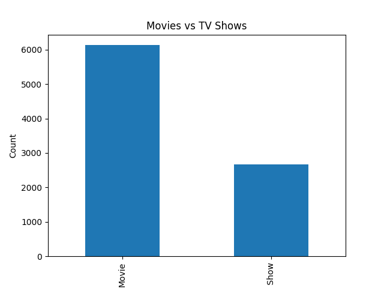

# Netflix Data Analysis

This project analyzes Netflix data using Python, Pandas and Matplotlib.

## Features
- CSV data processing
- Data analysis with Pandas
- Visualization with Matplotlib
- Movie vs TV Show comparison

## Technologies Used
- Python
- Pandas
- Matplotlib

## Visualization

